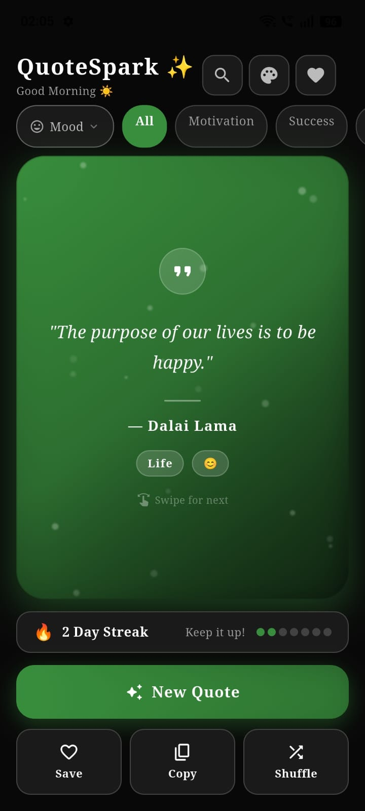
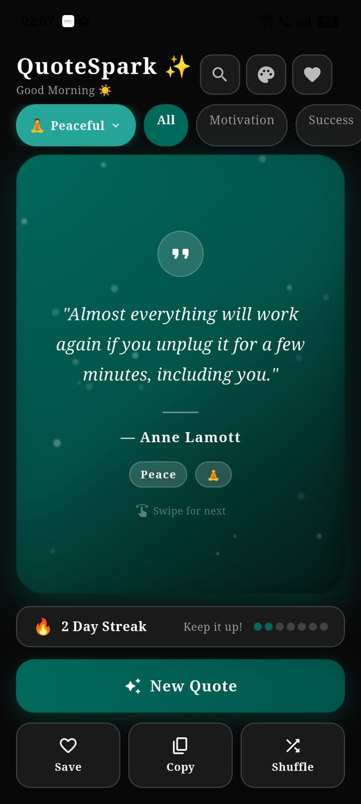
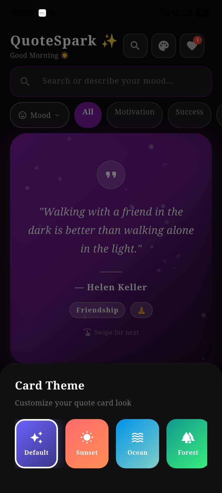

# QuoteSpark ✨

**A premium, mood-aware quote generator app built with Flutter.**

QuoteSpark detects your mood from what you type (in Hindi *and* English), shows you time-relevant quotes throughout the day, and wraps it all in a smooth, animated, glassmorphic UI with 8 customizable card themes.

> Built by **Ansh Mishra** as part of the **CodeAlpha App Development Internship**.

---

## 📱 Screenshots

<p align="center">
  
  
  
  
</p>

---

## 📥 Download

📦 **[Download Latest APK](https://drive.google.com/file/d/14aLbmqRpZ59heTipw_RiPIzQfVcSICKg/view?usp=drive_link)**

> Android only, tested on Android 13 (API 33) and real devices.

---

## ✨ Features

- 🧠 **Smart Mood Detection** — Type how you feel (Hindi or English) and the app automatically detects your mood and shows matching quotes
- 📚 **200+ Handpicked Quotes** across **13 categories**: Motivation, Success, Life, Wisdom, Happiness, Love, Peace, Strength, Healing, Friendship, Education, India, and more
- 🎭 **6 Mood Filters** — Motivated, Happy, Sad, Peaceful, Love, Strong
- 🕐 **Time-Based Quotes** — Morning shows motivational quotes, night shows peaceful ones, and the app greets you differently through the day
- 🔀 **No-Repeat Shuffle Algorithm** — Won't repeat a quote until you've seen every quote in the current filter (just like Spotify shuffle)
- 🎨 **8 Card Themes** — Default, Sunset, Ocean, Forest, Galaxy, Rose, Gold, Mint
- ✨ **Floating Particle Animation** — Custom-painted animated background particles for a premium feel
- 🔥 **Daily Streak Tracker** — 7-dot visual streak indicator to keep you coming back
- ❤️ **Favorites Screen** — Save quotes you love and revisit them anytime
- 👉 **Swipe Gestures** — Swipe left/right on the quote card to get a new quote
- 📋 **Copy to Clipboard** — One-tap copy of quote + author
- 🔍 **Smart Search** — Search by quote text, author, or category — also detects mood from your search query
- 📐 **Fully Responsive UI** — Built with `MediaQuery`, adapts cleanly to all phone sizes

---

## 🛠️ Tech Stack

| Category | Technology |
|---|---|
| Framework | Flutter (Dart) |
| Design System | Material Design 3 |
| Animation | `AnimationController`, `CustomPainter`, `Tween`, `CurvedAnimation` |
| Gestures | `GestureDetector` (swipe, tap) |
| State Management | `setState` (no external state management needed) |
| Backend | None — 100% frontend, all quotes stored locally |
| Platforms | Android (Web-compatible via Flutter) |

---

## 📂 Project Structure

```
codealpha_quote_generator/
├── lib/
│   └── main.dart              # Complete app (single-file architecture)
├── test/
│   └── widget_test.dart       # Widget tests
├── android/
│   ├── app/
│   │   └── src/main/AndroidManifest.xml   (label: "QuoteSpark")
│   └── gradle.properties
├── pubspec.yaml
└── README.md
```

---

## 🚀 Getting Started

### Prerequisites

- [Flutter SDK](https://docs.flutter.dev/get-started/install) (3.x or later)
- Android Studio (for emulator / SDK tools)
- A connected Android device or emulator

### Installation

```bash
# Clone the repository
git clone <your-github-repo-url>
cd codealpha_quote_generator

# Install dependencies
flutter pub get

# Run the app
flutter run
```

### Building a Release APK

```bash
flutter build apk --release
```

The generated APK will be located at:
```
build/app/outputs/flutter-apk/app-release.apk
```

### Running Tests

```bash
flutter test
```

---

## 🎯 How Mood Detection Works

QuoteSpark scans your search input against curated keyword lists for each mood — supporting both **English** and **Hindi** (romanized) keywords. For example:

- Typing "khushi" or "happy" → detects **Happy** mood
- Typing "dukh" or "heartbreak" → detects **Sad** mood
- Typing "exam" or "target" → detects **Motivated** mood

This lets users get relevant quotes just by describing how they feel, without manually selecting a filter.

---

## 🗺️ Roadmap / Future Plans

- [ ] iOS support
- [ ] Push notifications for daily quote reminders
- [ ] Cloud sync for favorites
- [ ] Widget for home screen
- [ ] Dark/Light theme toggle
- [ ] Integration with **Bharat Creators AI Super App**

---

## 👤 Developer

**Ansh Mishra**
BCA (AI), 1st Year
CodeAlpha Intern — App Development Domain

- 📧 Reach out via [LinkedIn](#) *(https://www.linkedin.com/in/anshmishra701?utm_source=share_via&utm_content=profile&utm_medium=member_androi)*
- 💼 [GitHub](#) *(https://github.com/AnshAI7)*

---

## 🙏 Acknowledgments

- **CodeAlpha** for the internship opportunity
- Quotes curated from various historical figures, philosophers, and thinkers including Buddha, Mahatma Gandhi, A.P.J. Abdul Kalam, Swami Vivekananda, and more

---

## 📄 License

This project was created for educational purposes as part of the CodeAlpha App Development Internship.

---

<p align="center">Made with ❤️ and Flutter</p>